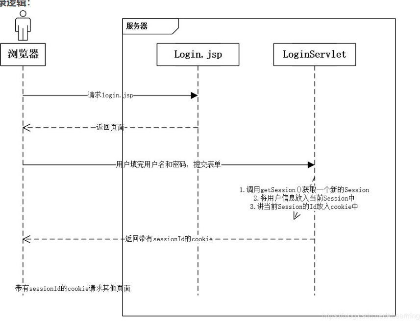

1. 前端登录表单基本完成,自动登录后面再加
2. 登录过滤器:每个页面检查是否登录,没有登录在阻止跳转到其他页面,直接跳转到登录页面

    这个也后面再加
3. 难点是记住密码,目前思路是:

    
4. 但将密码明文存储到cookie中似乎有点不安全,但不好搞
   总不能再加密一次吧,在加密一次到时候怎么让它登录呢
   将记住的密码直接输出到密码框肯定不安全,
   这个得让它不能查看不能复制,或者直接随便给一串字符串

